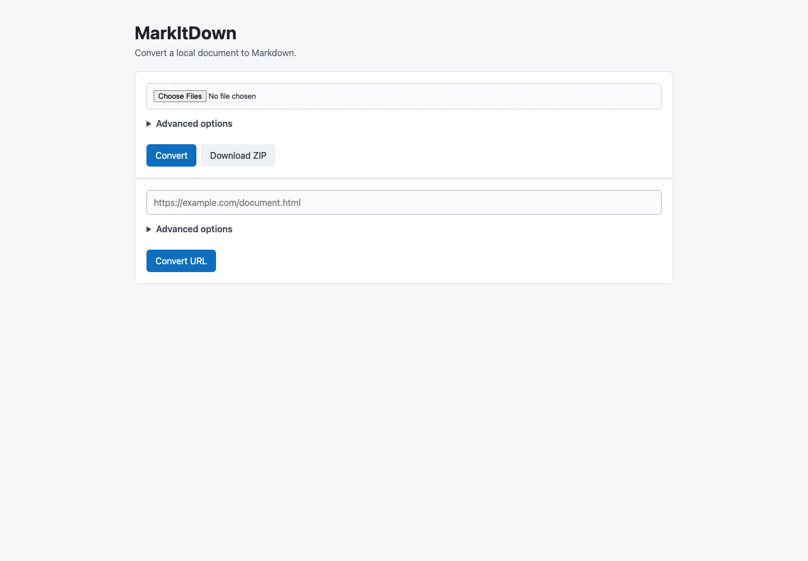
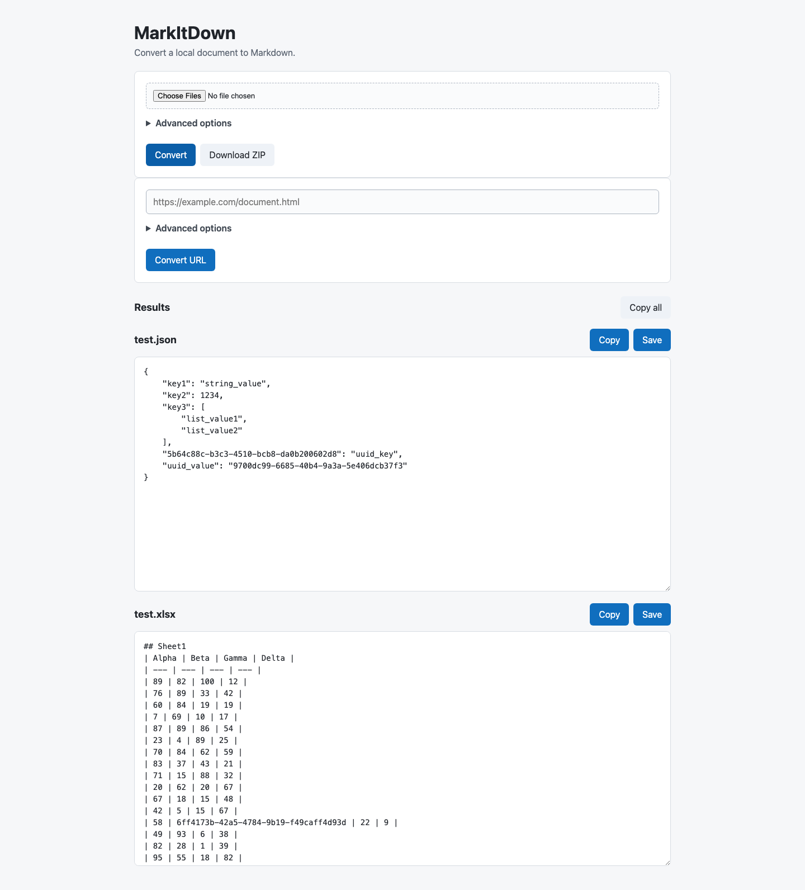
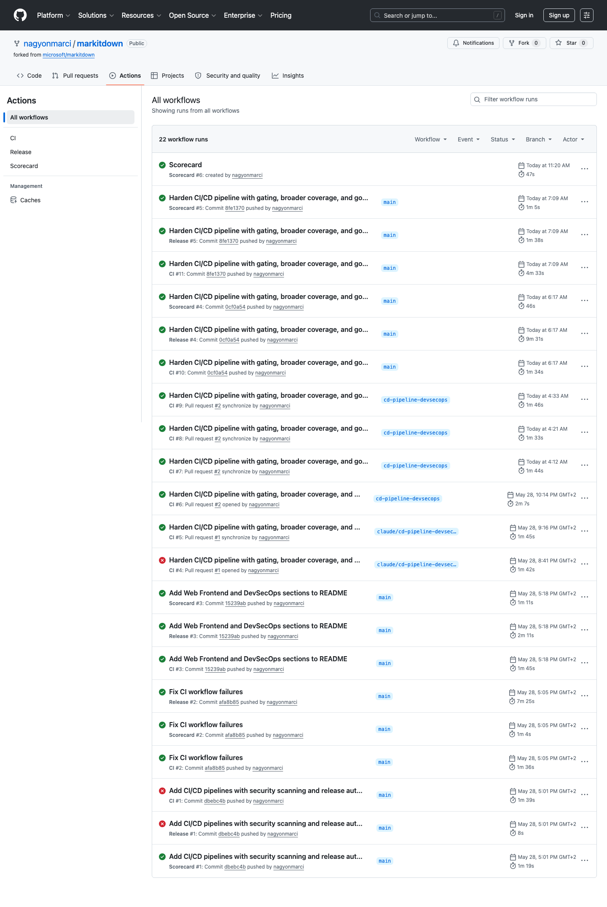

# MarkItDown

[](https://github.com/nagyonmarci/markitdown/actions/workflows/ci.yml)
[](https://github.com/nagyonmarci/markitdown/actions/workflows/release.yml)
[](https://securityscorecards.dev/viewer/?uri=github.com/nagyonmarci/markitdown)
[](https://github.com/nagyonmarci/markitdown/pkgs/container/markitdown)

> This is a fork of [**microsoft/markitdown**](https://github.com/microsoft/markitdown) — a lightweight Python utility for converting files (PDF, Office documents, images, audio, HTML, and more) to Markdown for use with LLMs and text-analysis pipelines.
>
> **The core conversion library is unchanged.** For installation, supported formats, the command-line and Python APIs, plugins, and the Azure Document Intelligence / Content Understanding integrations, see the **[upstream README »](https://github.com/microsoft/markitdown#readme)**.

## What this fork adds

This fork focuses on **shipping and operating** MarkItDown rather than on the conversion library itself:

- **[Web Frontend](#web-frontend)** — a self-contained Go web UI that exposes the full MarkItDown CLI over HTTP, with batch file upload, URL/YouTube conversion, and ZIP export.
- **[DevSecOps Pipeline](#devsecops-pipeline)** — a hardened, shift-left CI/CD pipeline with parallel security scanning, build gating, keyless image signing, and SBOM attestation.
- **[`markitdown-ocr` plugin](packages/markitdown-ocr/README.md)** — LLM-vision OCR for images embedded in PDF, DOCX, PPTX, and XLSX files, reusing the same `llm_client` / `llm_model` pattern MarkItDown already uses for image descriptions.

## Quick start

Run the web frontend locally with Docker Compose:

```sh
docker compose up
```

Then open <http://localhost:8088>. (Internally the container listens on port `8080`.)

The CI/CD pipeline also publishes a signed CLI image to the GitHub Container Registry:

```sh
docker run --rm -i ghcr.io/nagyonmarci/markitdown:latest < ~/your-file.pdf > output.md
```

---

## Web Frontend

The repository includes a lightweight web UI that exposes the full MarkItDown CLI over HTTP. It is written in Go and compiles to a self-contained static binary with zero runtime dependencies.

### Running the frontend

```sh
docker compose up
```

The UI is available at `http://localhost:8088`. Internally the container runs on port `8080`.

To build and run the frontend directly without Docker:

```sh
cd frontend
go build -o markitdown-frontend .
./markitdown-frontend
```

### Screenshots





### Features

**File conversion**
- Upload one or more files (PDF, DOCX, PPTX, XLSX, images, audio, …) up to 50 MB total
- Results are displayed inline in editable text areas
- Per-result **Copy** and **Save** buttons, plus a **Copy all** button for batch workflows
- **Download ZIP** — packages all converted Markdown files into a single archive in one click

**URL conversion**
- Paste any URL to convert a remote HTML page, document, or feed directly
- **YouTube support** — YouTube URLs are handled via a dedicated path: `yt-dlp` fetches video metadata (title, channel, duration, description) and English subtitles, which are assembled into a structured Markdown document with a transcript section

**Advanced options** (available for both file and URL modes)
- Extension hint — override the file type detected by MarkItDown
- Charset — specify the input encoding
- Use plugins — enable installed third-party MarkItDown plugins
- Keep data URIs — retain embedded base64 images in the output

**UX details**
- Fully responsive layout, works on mobile
- System dark mode support via `prefers-color-scheme`
- Zero JavaScript dependencies — vanilla JS, no bundler, no framework

### Architecture

The frontend is a thin HTTP adapter over the `markitdown` CLI binary. It spawns a subprocess per request (`exec.CommandContext` with a 2-minute timeout), streams the output back to the browser, and handles errors gracefully. This design keeps the Go code simple and ensures the frontend stays in sync with the CLI automatically — no duplicated conversion logic.

The multi-stage `frontend/Dockerfile` compiles the Go binary in a `golang:1.23` builder stage, then copies it into a Python runtime image with the `markitdown` CLI (and `yt-dlp`) installed, so all conversion dependencies are available at runtime.

---

## DevSecOps Pipeline

The repository ships a hardened, multi-stage CI/CD pipeline designed around **shift-left security**: every potential vulnerability is caught as early as possible — ideally before code lands on the main branch.

### Architecture overview

Three GitHub Actions workflows cover the full software delivery lifecycle:

| Workflow | Trigger | Purpose |
|---|---|---|
| [`ci.yml`](.github/workflows/ci.yml) | Every push to `main` + every PR | Quality gates and security scanning |
| [`release.yml`](.github/workflows/release.yml) | Push to `main` or version tag `v*.*.*` | Docker image build, signing, and publishing |
| [`scorecard.yml`](.github/workflows/scorecard.yml) | Weekly + every push to `main` | OSSF supply chain health score |



### Continuous Integration (`ci.yml`)

The CI workflow uses a **parallel fan-out** design — jobs are independent and run concurrently, minimising wall-clock time while maximising coverage. A `concurrency` group cancels superseded in-progress runs on the same pull request, so only the latest commit is scanned.

#### Code quality

| Job | Tool | What it checks |
|---|---|---|
| `lint` | [pre-commit](https://pre-commit.com/) + [Black](https://github.com/psf/black) | Consistent code formatting across the entire codebase |
| `typecheck` | [mypy](https://mypy-lang.org/) via [Hatch](https://hatch.pypa.io/) | Static type checking for all four packages (report-only while pre-existing type debt is cleared) |
| `test` | [Hatch](https://hatch.pypa.io/) + pytest | Functional correctness across packages on Python 3.10–3.13 |

The test matrix fans out per package and Python version: `markitdown` is tested on 3.10, 3.11, 3.12, and 3.13 (the version the shipped Docker image runs) and `markitdown-sample-plugin` on 3.12 — each as a separate gating job, so a version- or package-specific regression is pinpointed precisely. `markitdown-ocr` runs as a non-blocking leg until a pre-existing test failure (`test_pdf_multipage`) is triaged.

#### Security scanning

Six independent security lenses run in parallel on every push:

**1. Secret detection — Gitleaks**

[Gitleaks](https://github.com/gitleaks/gitleaks) performs a **full-history scan** (not just the HEAD diff) to detect accidentally committed credentials, API keys, and tokens before they can reach an attacker. Scanning the full history closes the gap where a secret committed and later deleted would otherwise go unnoticed.

**2. Static Application Security Testing — CodeQL + Semgrep**

Two independent SAST engines run in parallel:

- **[CodeQL](https://codeql.github.com/)** — GitHub's semantic analysis engine builds a code property graph and queries it for known vulnerability patterns. Both Python and Go are analysed in separate matrix jobs, so a finding in either language is surfaced independently.
- **[Semgrep](https://semgrep.dev/)** — rule-based scanner running the `p/python` and `p/owasp-top-ten` rulesets, covering injection flaws, insecure deserialization, broken access control, and the full OWASP Top 10. Findings are published to the Security tab as SARIF.

Running two independent SAST tools reduces false-negative rates — each engine uses different analysis techniques and may catch what the other misses.

**3. Container hardening — hadolint**

Both `Dockerfile` (Python runtime image) and `frontend/Dockerfile` (multi-stage Go build) are linted with [hadolint](https://github.com/hadolint/hadolint) against Dockerfile best practices: unnecessary packages, pinned base images, layer hygiene, and privilege escalation risks. The failure threshold is set to `error` so informational suggestions don't block CI while genuine misconfigurations do.

**4. Infrastructure-as-Code scanning — Checkov**

[Checkov](https://www.checkov.io/) (Prisma Cloud) scans `compose.yaml` for Docker Compose misconfigurations: containers running as root, missing health checks, exposed secrets, insecure bind mounts, and writable container filesystems. The scan **fails the build** on any finding (`soft_fail: false`), and `compose.yaml` is hardened to match: a `read_only` root filesystem with a `/tmp` tmpfs, `cap_drop: ALL`, `no-new-privileges`, resource limits, and a healthcheck. Results are also uploaded as SARIF to the Security tab.

**5. Container image vulnerability scan — Trivy**

The Docker image is built from source and scanned with [Trivy](https://github.com/aquasecurity/trivy) for CVEs at `HIGH` and `CRITICAL` severity. The scan runs against the **built artifact**, not just the Dockerfile, which catches vulnerabilities introduced by transitive Python or system dependencies that static analysis cannot see. The complete result set is uploaded as SARIF, and a second gate step **fails the build** on *fixable* HIGH/CRITICAL CVEs (`ignore-unfixed: true`) — so an actionable, patchable vulnerability blocks merge while an unpatched upstream advisory doesn't permanently wedge the pipeline.

**6. Python dependency audit — pip-audit**

[pip-audit](https://github.com/pypa/pip-audit) resolves the installed dependency tree (matching what ships in the Docker image) and checks it against the [PyPI Advisory Database](https://github.com/pypa/advisory-database). It runs report-only for now, complementing Trivy with Python-package-level CVE visibility that an image scan attributes to the OS layer.

#### PR gates

- **Dependency review** — surfaces newly introduced dependencies with known CVEs or incompatible licenses on every pull request (advisory / non-blocking).
- **Security summary** — a bot posts a **sticky comment** on every PR with a consolidated table of all security job results. The comment is updated in-place on each new push, so reviewers always see the current state without scrolling through history.
- **Code ownership** — a [`CODEOWNERS`](.github/CODEOWNERS) file routes review requests for the CI/CD workflows, Dockerfiles, and `compose.yaml` to their owners, so changes to security-critical infrastructure always get a designated reviewer.

### Release & Supply Chain Security (`release.yml`)

The release pipeline automates the full supply chain from source commit to signed, attested, published artifact.

#### Multi-architecture builds

Images are built for both `linux/amd64` and `linux/arm64` using Docker Buildx and QEMU emulation. A single OCI image manifest covers both platforms — no user-side configuration required.

#### GitHub Container Registry (GHCR)

Images are published to `ghcr.io/nagyonmarci/markitdown` with a semantic tag strategy driven by [`docker/metadata-action`](https://github.com/docker/metadata-action):

| Tag | When | Meaning |
|---|---|---|
| `latest` | Every `main` push | Most recent main build |
| `<branch>` | Every branch push | Per-branch image for integration testing |
| `<major>.<minor>` | Git version tag | Floating minor version |
| `<major>.<minor>.<patch>` | Git version tag | Immutable patch release |

#### Keyless image signing — Cosign + Sigstore

Every image is signed using [Cosign](https://github.com/sigstore/cosign) in **keyless mode** via [Sigstore's](https://www.sigstore.dev/) Fulcio CA and Rekor transparency log. No long-lived private keys are stored anywhere in the repository or in CI secrets. The signature binds the image digest to the GitHub Actions OIDC identity, making it cryptographically verifiable that:

1. The image was produced by this specific workflow run.
2. It corresponds to a specific commit in this repository.
3. It has not been tampered with after publication.

Verification:
```sh
cosign verify ghcr.io/nagyonmarci/markitdown:latest \
  --certificate-identity-regexp "https://github.com/nagyonmarci/markitdown/.*" \
  --certificate-oidc-issuer "https://token.actions.githubusercontent.com"
```

#### Software Bill of Materials (SBOM)

A [CycloneDX JSON SBOM](https://cyclonedx.org/) is generated for every released image using [`anchore/sbom-action`](https://github.com/anchore/sbom-action). The SBOM is attested and pushed to the registry alongside the image as an OCI referrer, making it queryable:

```sh
cosign verify-attestation ghcr.io/nagyonmarci/markitdown:latest \
  --type cyclonedx \
  --certificate-identity-regexp "https://github.com/nagyonmarci/markitdown/.*" \
  --certificate-oidc-issuer "https://token.actions.githubusercontent.com"
```

This fulfils emerging regulatory requirements (e.g. US Executive Order 14028) that mandate a machine-readable inventory of all software components in distributed artifacts.

#### Post-publish vulnerability scan

After the image is pushed, Trivy scans the **published registry image** (not the local build cache) for `HIGH` and `CRITICAL` CVEs. This catches any discrepancy between the local build environment and what actually landed in the registry. Results are uploaded as SARIF to the Security tab, and — mirroring CI — a gate step fails the release on *fixable* HIGH/CRITICAL findings (`ignore-unfixed: true`).

#### GitHub Releases

On version tags (`v*.*.*`), a GitHub Release is created automatically with machine-generated release notes aggregated from merged PR titles and labels — no manual changelog entry required.

### OSSF Scorecard (`scorecard.yml`)

The pipeline participates in the [OpenSSF Scorecard](https://securityscorecards.dev/) program, which grades the repository's supply chain hygiene across 18 automated checks including:

- Branch protection and review requirements
- CI/CD pipeline security and pinned actions
- Dependency update automation
- Vulnerability disclosure policy
- Binary artifact and dangerous workflow checks

The score runs weekly and on every push to `main`, with SARIF results integrated into GitHub's Security tab. The public badge at the top of this README reflects the current live score.

### Automated dependency updates — Dependabot

[Dependabot](https://docs.github.com/en/code-security/dependabot) monitors four package ecosystems weekly and opens PRs automatically:

| Ecosystem | Directory | Covers |
|---|---|---|
| `github-actions` | `/` | Action version pins in all workflows |
| `pip` | `/packages/markitdown` | Python runtime dependencies |
| `gomod` | `/frontend` | Go module dependencies |
| `docker` | `/`, `/frontend` | Base image tags in both Dockerfiles |

Dependabot PRs are validated by the full CI pipeline before any human reviews them, so a failing security scan on a dependency update is surfaced immediately.

---

## Contributing & License

This fork tracks [microsoft/markitdown](https://github.com/microsoft/markitdown). Improvements to the **core conversion library** are best contributed upstream — see the upstream [contributing guide](https://github.com/microsoft/markitdown#contributing) and its [Security Considerations](https://github.com/microsoft/markitdown#security-considerations). Changes specific to this fork (the web frontend, the CI/CD pipeline, and the `markitdown-ocr` plugin) are welcome here.

Released under the [MIT License](LICENSE).

### Trademarks

This project may contain trademarks or logos for projects, products, or services. Authorized use of Microsoft
trademarks or logos is subject to and must follow
[Microsoft's Trademark & Brand Guidelines](https://www.microsoft.com/en-us/legal/intellectualproperty/trademarks/usage/general).
Use of Microsoft trademarks or logos in modified versions of this project must not cause confusion or imply Microsoft sponsorship.
Any use of third-party trademarks or logos are subject to those third-party's policies.
